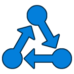
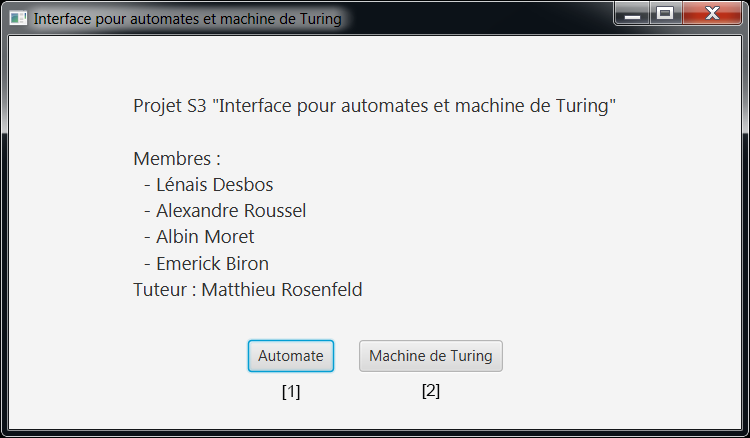
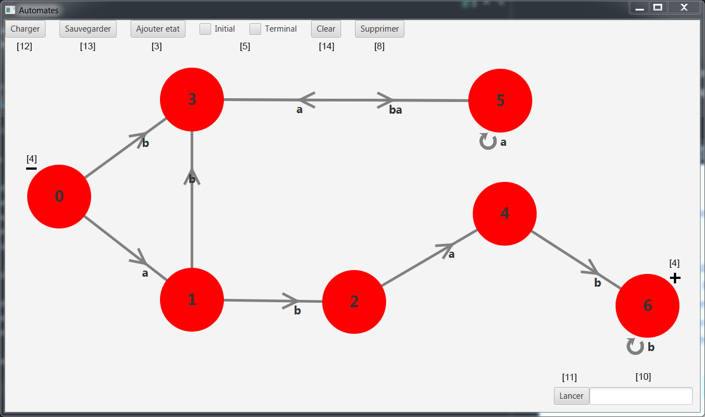
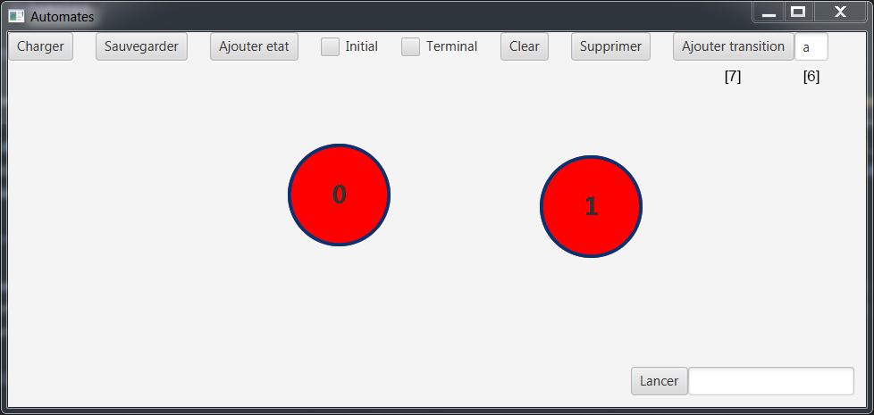
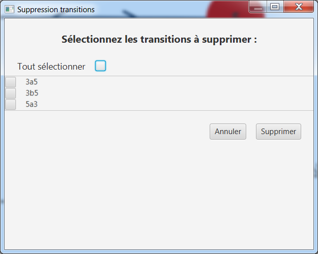
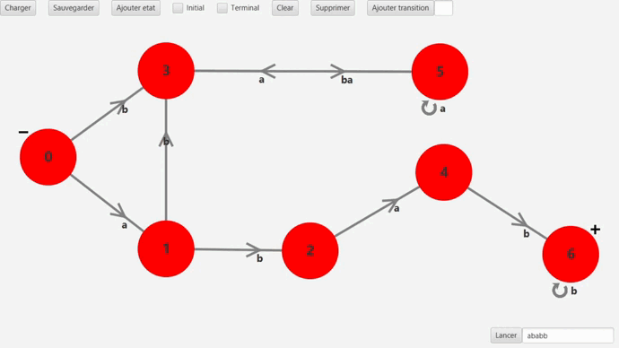

# Projet S3 Interface pour automates et machine de Turing

## Introduction 

### Membres

- Emerick Biron
- Albin Moret
- Alexandre Roussel
- Lénais Desbos

**Tuteur : Matthieu Rosenfeld**

### Remerciements
Nous souhaitons remercier tout particulièrement notre tuteur de projet Matthieu Rosenfeld, qui nous a accompagné et 
conseillé tout au long du projet.Il a su nous guider à travers les difficultés techniques et a pris le temps d’apporter
des critiques constructives à notre travail et de répondre à nos nombreuses questions. Grâce au temps qu’il nous a
accordé chaque semaine nous avons acquis un rythme de travail satisfaisant pour la réalisation de ce projet.

### Notre projet
L’objectif du projet “interface pour automates et machines de Turing” est de réaliser un logiciel pour l’utilisation 
d’automates et de machines de Turing.

Cette interface permet de réaliser, ou d’importer, un automate ou machine de Turing afin de visualiser leur 
fonctionnement, et de vérifier s’il reconnaît un mot donné par un utilisateur.

Le logiciel supporte deux formats de fichiers qui lui sont propres, .atmt et .mt qui contiennent des données relatives
aux machines comme les états, les transitions et leur position.

Ces formats de fichiers permettent d’importer et de sauvegarder les créations des utilisateurs.

La mise en œuvre graphique de ce projet a nécessité d'utiliser le langage java avec l'utilisation du framework javafx 
pour la partie interface.

## Manuels 

Lors du lancement de l'application une fenêtre s'ouvrira et vous permettra de choisir de lancer l'application de gestion
d'automates [[1]](#fentre-de-dpart) ou l'application de gestion de machines de Turing [[2]](#fentre-de-dpart)

### Fenêtre de départ 

### Automates

#### Les états

Pour ajouter un état à l'automate, il suffit de cliquer sur le bouton "ajouter état" [[3]](#interface-dun-automate-).
Pour qu'un état soit initial ou final (représenté par les - et les + à côté des états) [[4]](#interface-dun-automate-),
il suffit de cocher les cases "initial" ou "terminal" [[5]](#interface-dun-automate-) avant de créer l'état, ou après
avoir sélectionné l'état que l'on souhaite modifier (si plusieurs états sont sélectionnés, seul le dernier à avoir été
sélectionné sera modifié). Pour déplacer un état, il suffit de le faire glisser avec la souris.

#### Les transitions

Pour ajouter une transition, il faut d'abord sélection l'état d'arrivée puis l'état de départ (ou seulement un état pour
une auto-transition). Il faut ensuite ajouter la lettre de la transition dans le cadre qui apparait en haut à
droite [[6]](#ajout-dune-transition-) puis cliquer sur le bouton "ajouter transition" [[7]](#ajout-dune-transition-).

#### La sélection

Pour sélectionner un état ou une transition il suffit de cliquer dessus. Cet élément aura donc un contour bleu. Il faut
maintenir la touche "Ctrl" enfoncé et cliquer sur un autre élément afin de sélectionner plusieurs éléments.

#### La suppression

Un appui sur le bouton "Supprimer" [[8]](#interface-dun-automate-) supprimera tous les éléments sélectionnés. Dans le
cas où plusieurs transitions entre deux mêmes états seraient sélectionnées [[9]](#suppression-de-multiples-transition-)
une [fenêtre de dialogue](#suppression-de-multiples-transition-) s'ouvrira afin de vous permettre de choisir
spécifiquement les transitions à supprimer.

#### Le lancement d'un automate

Pour lancer un automate il faut écrire le mot a tester dans la zone prévue à cet effet [[10]](#interface-dun-automate-)
puis appuyer sur le bouton "Lancer" [[11]](#interface-dun-automate-). Vous pouvez
retrouver [ici](#lancement-dun-automate) un exemple.

#### Informations complémentaires

Il est possible de charger [[12]](#interface-dun-automate-) ou de sauvegarder [[13]](#interface-dun-automate-) un
automate sous la forme de fichiers _.atmt_. Il est aussi possible de supprimer l'ensemble d'un automate en appuyant sur
le bouton "Clear" [[14]](#interface-dun-automate-).

#### Interface d'un automate

#### Ajout d'une transition

#### Suppression de multiples transition

#### Lancement d'un automate

