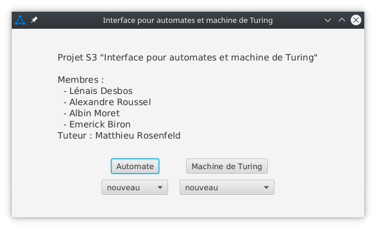
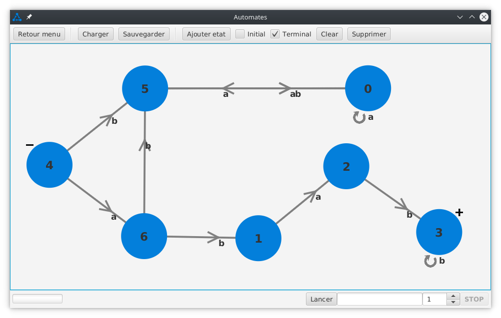
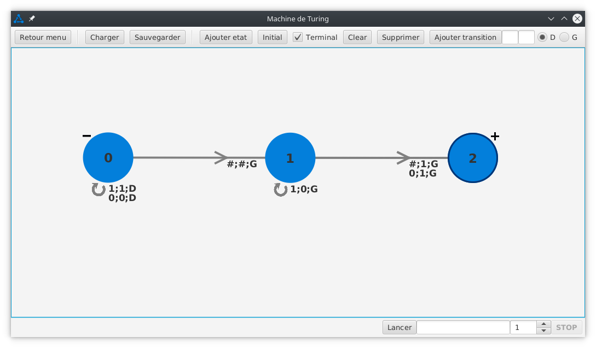

# Projet S3 Interface pour automates et machine de Turing


## Table des matières

* [Tables des matières](#table-des-matires)  
* [Table des figures](#table-des-figures)
* [Introduction](#introduction)
  * [Membres du projet](#membres-du-projet)
  * [Remerciements](#remerciements)
  * [Notre projet](#notre-projet)
* [Manuel de notre application](#manuel-de-notre-application)
  * [1 - Fenêtre de départ](#1---fentre-de-dpart)
  * [2 - Automates](#2---automates)
    * [2.1 - Les états](#21---les-tats)
    * [2.2 - Les transitions](#22---les-transitions)
    * [2.3 - La sélection](#23---la-slection)
    * [2.4 - La suppression](#24---la-suppression)
    * [2.5 - Le lancement d'un automate](#25---le-lancement-dun-automate)
    * [2.6 - Fichiers *.atmt*](#26---fichiers-atmt)
    * [2.7 La sauvegarde / le chargement de fichiers *.atmt*](#27-la-sauvegarde--le-chargement-de-fichiers-atmt)
  * [3 - Machine de Turing](#3---machine-de-turing)
      * [3.1 - Les états](#31---les-tats)
      * [3.2 - Les transitions](#32---les-transitions)
      * [3.3 - La sélection](#33---la-slection)
      * [3.4 - La suppression](#34---la-suppression)
      * [3.5 - Le lancement d'une machine de Turing](#35---le-lancement-dune-machine-de-turing)
      * [3.6 - Fichiers *.mt*](#36---fichiers-mt)
      * [3.7 La sauvegarde / le chargement de fichiers *.mt*](#37-la-sauvegarde--le-chargement-de-fichiers-mt)

## Table des figures

* [Figure 1 - Fenêtre de depart](#figure1)
* [Figure 2 - Interface d'un automate](#figure2)
* [Figure 3 - Ajout d'une transition (automate)](#figure3)
* [Figure 4 - Fenêtre de dialogue pour la suppression de transitions (automate)](#figure4)
* [Figure 5 - Lancement d'un automate](#figure5)
* [Figure 6 - Interface d'une machine de Turing](#figure6)
* [Figure 7 - Ajout d'une transition (machine de Turing)](#figure7)
* [Figure 8 - Fenêtre de dialogue pour la suppression de transitions (machine de Turing)](#figure8)
* [Figure 9 - Lancement d'une machine de Turing](#figure9)

## Introduction 

### Membres du projet

- Emerick Biron
- Albin Moret
- Alexandre Roussel
- Lénais Desbos

**Tuteur : Matthieu Rosenfeld**

### Remerciements
Nous souhaitons remercier tout particulièrement notre tuteur de projet Matthieu Rosenfeld, qui nous a accompagnés et 
conseillés tout au long du projet. Il a su nous guider à travers les difficultés techniques et a pris le temps 
d’apporter des critiques constructives à notre travail et de répondre à nos nombreuses questions. Grâce au temps qu’il 
nous a accordé chaque semaine nous avons acquis un rythme de travail satisfaisant pour la réalisation de ce projet.

### Notre projet

Dans le cadre de notre formation, nous devions réaliser un projet tuteuré lors du semestre 3 de notre DUT Informatique.

Le sujet de notre projet été “interface pour automates et machines de Turing”.

L’objectif du projet “interface pour automates et machines de Turing” est de réaliser un logiciel pour l’utilisation 
d’automates et de machines de Turing.

Cette interface permet de réaliser, ou d’importer, un automate ou machine de Turing afin de visualiser leur 
fonctionnement, et de vérifier s’il reconnaît un mot donné par un utilisateur.

Le logiciel supporte deux formats de fichiers qui lui sont propres, .atmt et .mt qui contiennent des données relatives
aux machines comme les états, les transitions et leur position.

Ces formats de fichiers permettent d’importer et de sauvegarder les créations des utilisateurs.

La mise en œuvre graphique de ce projet a nécessité d'utiliser le langage java avec l'utilisation du framework javafx 
pour la partie interface.

# Manuel de notre application

### 1 - Fenêtre de départ 

Lors du lancement de l'application une fenêtre s'ouvrira et vous permettra de choisir de lancer l'application de gestion
d'automates en appuyant sur le bouton *Automate* [(cf. Figure1)](#figure1).

La liste déroulante, en dessous du bouton *Automate* permet de choisir de partir d'un nouvel automate si l'option 
*nouveau* est choisis ou de charger directement des fichiers *.atmt* en choisissant les noms de ces derniers. 
Les fichiers pouvant être chargés sont les fichiers présents dans le répertoire *default* du répertoire 
*fichiers_machines* [(cf. 2.6)](#26---fichiers-atmt)

**Les fichiers *.atmt* doivent impérativement se situer dans un répertoire *default*, lui-même situé dans un répertoire
*fichiers_machines* qui doit être au même endroit que le jar de l'application pour être proposé par la liste 
déroulante**

<a name="figure1"></a>

*Figure 1 - Fenêtre de depart*

### 2 - Automates

<a name="figure2"></a>

*Figure 2 - Interface d'un automate*

#### 2.1 - Les états

Pour ajouter un état à l'automate, il suffit de cliquer sur le bouton *ajouter état*.

Pour qu'un état soit initial ou final (représenté par les - et les + à côté des états) il suffit de cocher les cases 
*initial* ou *terminal* avant de créer l'état, ou après avoir sélectionné l'état que l'on souhaite modifier (si 
plusieurs états sont sélectionnés, seul le dernier à avoir été sélectionné sera modifié). 

Pour déplacer un état, il suffit de le faire glisser avec la souris.

[(cf. Figure2)](#figure2)

#### 2.2 - Les transitions

Pour ajouter une transition, il faut **d'abord** sélectionner l'état d'arrivée **puis** l'état de départ
(ou seulement un état pour une auto-transition). Il faut ensuite ajouter la lettre de la transition dans le cadre qui 
apparait en haut à droite puis cliquer sur le bouton *ajouter transition*.

[(cf. Figure3)](#figure3)

<a name="figure3"></a>

*Figure 3 - Ajout d'une transition (automate)*

#### 2.3 - La sélection

Pour sélectionner un état ou une transition, il suffit de cliquer dessus. Cet élément aura donc un contour bleu. Pour
sélectionner plusieurs éléments, il faut maintenir la touche *Ctrl* enfoncée et cliquer sur un autre élément.

#### 2.4 - La suppression

Un appui sur le bouton *Supprimer* supprimera tous les éléments sélectionnés [(cf. 2.3)](#23---la-slection). Dans le cas 
où plusieurs transitions entre deux mêmes états seraient sélectionnées une fenêtre de dialogue s'ouvrira afin de vous 
permettre de choisir spécifiquement les transitions à supprimer [(cf. Figure4)](#figure4).

Il est aussi possible de supprimer tous les états et toutes les transitions en appuyant sur le bouton *Clear*.

<a name="figure4"></a>

*Figure 4 - Fenêtre de dialogue pour la suppression de transitions (automate)*

#### 2.5 - Le lancement d'un automate

Pour lancer un automate, il faut écrire le mot à tester dans la zone prévue à cet effet puis appuyer sur le bouton 
*Lancer* [(cf. Figure2)](#figure2). Vous pouvez voir la progression de la lecture du mot en bas de l'application. À la 
fin de l'exécution une fenêtre s'ouvrira et vous indiquera si le mot a été reconnu par l'automate. Vous pouvez retrouver 
un exemple [ici](#figure5).

La vitesse d'exécution de l'automate peut-être modifié via le spinner présent à la droite de la zone du mot à tester.
Cette valeur représente le temps, en seconde, qui s'écoulera entre deux étapes de l'exécution de l'automate. 

Il est aussi possible d'arrêter l'exécution de l'automate en appuyant sur le bouton *STOP*.

<a name="figure5"></a>

*Figure 5 - Lancement d'un automate*

#### 2.6 - Fichiers *.atmt*

Nous avons créé un type de fichier : les fichiers *.atmt*. Ces fichiers permettent de stocker les automates dans un 
fichier. La partie du fichier situé après les *###* permet de stocker la position graphique des états.

Exemple de structure d'un fichier *.atmt* :

```text
4                   (nombre total d'états)
initial 0           (état initial)
terminal 2          (état terminal)
terminal 3          (état terminal)
0 b 1               (transition de l'état 0 vers l'état 1 portant la lettre b)
0 a 0
1 d 3
1 c 2
1 b 1
###
0 79.0 179.0 0      (position de l'état 0 graphiquement et son label, ici 0)
1 343.0 176.0 1
2 563.0 97.0 3
3 555.0 326.0 2
```

**Attention, les numéros des états dans les fichiers *.atmt* ne correspondent pas forcément au numéro affiché. Le numéro
affiché et celui spécifié après la position de l'état.**

#### 2.7 La sauvegarde / le chargement de fichiers *.atmt*

Il est possible de charger ou de sauvegarder un automate sous la forme de fichiers *.atmt* 
[(cf. 2.6)](#26---fichiers-atmt) via les boutons *Sauvegarder* et *Charger* [(cf. Figure2)](#figure2)

### 3 - Machine de Turing

<a name="figure6"></a>

*Figure 6 - Interface d'une machine de Turing*

#### 3.1 - Les états

Le fonctionnement des états pour une machine de Turing est identique à celui des états pour un automate 
[(cf. 2.1)](#21---les-tats). Cependant, dans notre projet, il ne peut y avoir plusieurs états initiaux pour une machine
de Turing. La case *initial* a donc été remplacée par un bouton *initial* [(cf. Figure6)](#figure6).

#### 3.2 - Les transitions

Pour ajouter une transition, il faut **d'abord** sélectionner l'état d'arrivée **puis** l'état de départ
(ou seulement un état pour une auto-transition). Il faut ensuite ajouter une lettre de lecture, une lettre d'écriture 
et un mouvement (gauche ou droite), via les cadres et les boutons radios situés en haut à gauche, puis cliquer sur le
bouton *ajouter transition* [(cf. Figure7)](#figure7).

<a name="figure7"></a>

*Figure 7 - Ajout d'une transition (machine de Turing)*

#### 3.3 - La sélection

Pour sélectionner un état ou une transition, il suffit de cliquer dessus. Cet élément aura donc un contour bleu. Pour
sélectionner plusieurs éléments, il faut maintenir la touche *Ctrl* enfoncée et cliquer sur un autre élément.

#### 3.4 - La suppression

Un appui sur le bouton *Supprimer* supprimera tous les éléments sélectionnés [(cf. 3.3)](#33---la-slection). Dans le cas
où plusieurs transitions entre deux mêmes états seraient sélectionnées une fenêtre de dialogue s'ouvrira afin de vous
permettre de choisir spécifiquement les transitions à supprimer [(cf. Figure8)](#figure8).

Il est aussi possible de supprimer tous les états et toutes les transitions en appuyant sur le bouton *Clear*.

<a name="figure8"></a>

*Figure 8 - Fenêtre de dialogue pour la suppression de transitions (machine de Turing)*

#### 3.5 - Le lancement d'une machine de Turing

Pour lancer une machine de Turing, il faut écrire le ruban initial à tester dans la zone prévue à cet effet puis appuyer 
sur le bouton *Lancer* [(cf. Figure6)](#figure6). Vous pouvez suivre l'évolution du ruban de la machine en bas de 
l'écran. À la fin de l'exécution une fenêtre s'ouvrira et vous indiquera le résultat du calcul et si ce dernier est 
valide. Vous pouvez retrouver un exemple [ici](#figure9).

La vitesse d'exécution de l'automate peut-être modifié via le spinner présent à la droite de la zone du mot à tester.
Cette valeur représente le temps, en seconde, qui s'écoulera entre deux étapes de l'exécution de l'automate.

Il est aussi possible d'arrêter l'exécution de l'automate en appuyant sur le bouton *STOP*.

<a name="figure9"></a>

*Figure 9 - Lancement d'une machine de Turing*

#### 3.6 - Fichiers *.mt*

Nous avons créé un deuxième type de fichier : les fichiers *.mt*. Ces fichiers permettent de stocker les machines de
Turing dans un fichier. La partie du fichier situé après les *###* permet de stocker la position graphique des états.

Exemple de structure d'un fichier *.mt* :

```text
3                   (nombre total d'états)
initial 0           (état initial)
terminal 1          (état terminal)
0 # 2 # GAUCHE      (transition de l'état 0 à l'état 2 ayant # en lecture, # en écriture et ayant le mouvement gauche)
0 1 0 1 DROITE
0 0 0 0 DROITE
2 # 1 1 GAUCHE
2 1 2 0 GAUCHE
2 0 1 1 GAUCHE
###
0 187.0 158.0 0     (position de l'état 0 graphiquement ainsi que son label)
1 854.0 157.0 2
2 521.4 156.8 1
```

**Attention, les numéros des états dans les fichiers *.mt* ne correspondent pas forcément au numéro affiché. Le numéro
affiché et celui spécifié après la position de l'état.**

#### 3.7 La sauvegarde / le chargement de fichiers *.mt*

Il est possible de charger ou de sauvegarder un automate sous la forme de fichiers *.mt*
[(cf. 3.6)](#36---fichiers-mt) via les boutons *Sauvegarder* et *Charger* [(cf. Figure6)](#figure6)